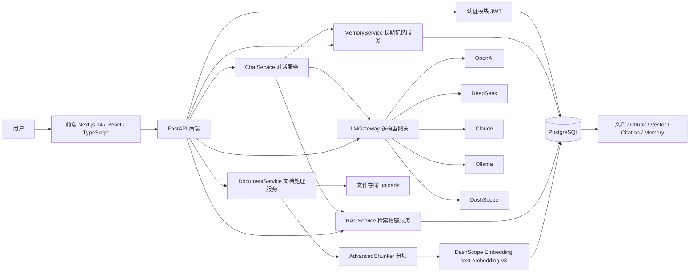
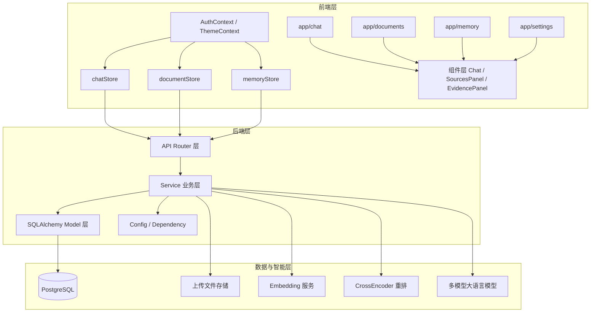
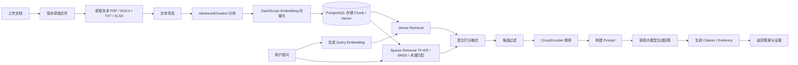
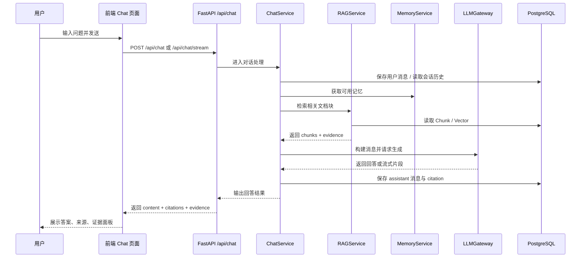
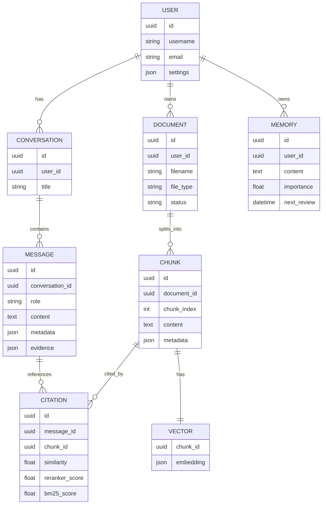
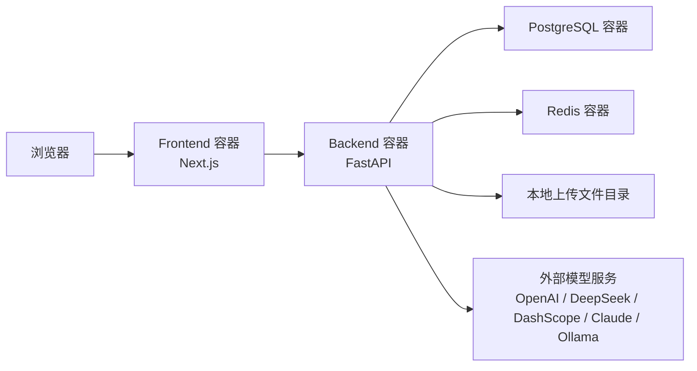
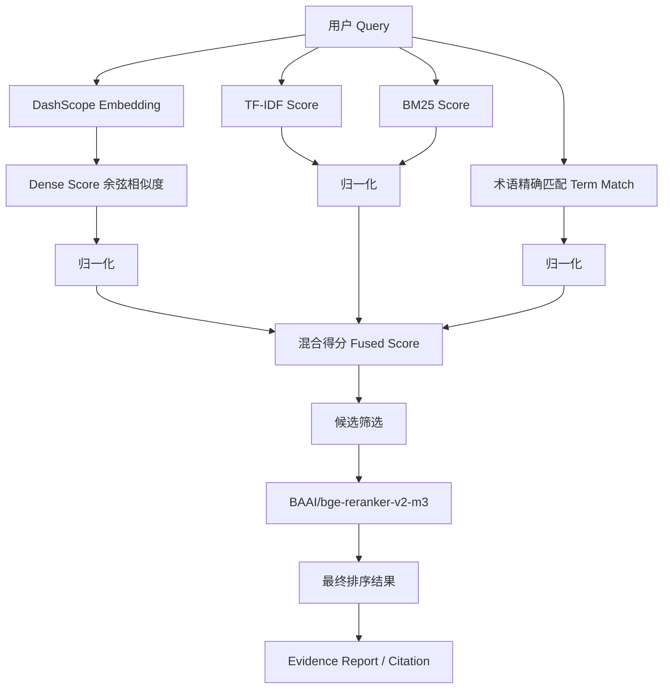

# 知识问答系统项目综合技术文档

## 1. 文档说明

本文档面向以下使用场景：

- 项目立项说明
- 课程设计/实验报告撰写
- 技术答辩材料整理
- 团队交接与后续维护
- 系统架构梳理与优化依据

本文档基于当前仓库代码、目录结构、接口设计、前后端实现、部署脚本、配置文件和测试脚本整理而成，目标是形成一份覆盖项目全貌的综合性技术文档。

---

## 2. 项目概述

### 2.1 项目名称

知识问答系统 / Cogniva 智能知识问答平台

### 2.2 项目定位

本项目是一个面向本地知识库问答场景的智能应用系统，核心目标是将用户上传的文档转化为可检索、可推理、可追溯的知识源，并通过大语言模型实现基于文档上下文的智能问答。同时，系统还扩展了长期记忆管理能力，支持对重要信息进行复习与管理。

### 2.3 核心特点

- 支持 PDF、Word、Excel、TXT、Markdown 等多种文档格式上传
- 对文档内容进行抽取、清洗、分块与向量化处理
- 基于 RAG 实现检索增强问答
- 支持 DeepSeek、OpenAI、Claude、Ollama、DashScope 等多种模型接入
- 支持多轮对话、对话历史保存、流式输出
- 支持引用来源展示与证据分析
- 支持长期记忆创建、复习与统计
- 提供前后端分离界面和 Docker 部署能力

---

## 3. 实验背景

### 3.1 背景说明

随着大语言模型能力的不断提升，基于通用模型的问答系统已经具备较强的自然语言理解和生成能力。但纯模型问答存在以下明显问题：

- 模型知识存在时效性限制
- 无法直接访问用户私有文档
- 回答缺乏明确依据，难以追溯
- 容易出现幻觉问题

为解决上述问题，RAG 技术逐渐成为构建知识型智能系统的重要方案。RAG 将“信息检索”和“语言生成”结合起来，先从知识库中找出相关内容，再将这些内容作为上下文输入模型，从而提高回答的准确性、相关性和可解释性。

本项目正是在这一背景下构建，旨在实现一个面向本地知识库场景的智能问答平台。

### 3.2 选题意义

- 研究大语言模型与知识库结合的工程落地方式
- 探索本地私有知识问答系统的完整实现路径
- 验证文档处理、语义检索、流式对话和引用追踪的协同效果
- 为课程设计、毕业设计、企业内部知识平台提供可复用参考

---

## 4. 实验目的

本项目的实验目的可以从理论、工程和应用三个层面来理解。

### 4.1 理论目的

- 理解 RAG 的完整工作流程
- 掌握文档分块、向量化、检索、重排、上下文构建等关键技术
- 理解前后端分离架构在智能系统中的组织方式

### 4.2 工程目的

- 实现一个可运行的本地知识问答系统
- 建立从文档上传到问答生成的完整闭环
- 实现流式输出、多模型切换、证据展示等增强能力
- 形成一套可扩展的系统架构

### 4.3 应用目的

- 为用户提供面向私有文档的高质量问答服务
- 实现文档知识的沉淀、检索与复用
- 通过长期记忆模块提高信息管理与复习效率

---

## 5. 实验内容

本项目的实验内容主要包括以下几个部分：

### 5.1 文档处理实验

- 上传多种格式文档
- 提取文档文本内容
- 对文本进行预处理和智能分块
- 生成向量并存储

### 5.2 检索增强问答实验

- 接收用户问题
- 基于问题进行向量检索与关键词匹配
- 生成候选上下文
- 将上下文与问题组合后调用大模型生成回答

### 5.3 多模型接入实验

- 统一封装不同 LLM 服务商调用方式
- 验证不同模型在问答任务中的可用性
- 支持切换不同模型进行生成

### 5.4 流式对话实验

- 使用 SSE 实现流式消息输出
- 验证长回答场景下的交互体验

### 5.5 证据追踪与可解释性实验

- 保存回答引用的文档块
- 对检索结果生成证据报告
- 在前端展示来源和可信度分析

### 5.6 长期记忆实验

- 创建记忆条目
- 使用类 SM-2 规则安排复习时间
- 从对话中抽取可记忆内容
- 展示记忆统计与复习计划

---

## 6. 技术路线

本项目总体采用“前后端分离 + 文档知识库 + RAG + 多模型网关 + 记忆管理”的技术路线。

整体流程如下：

1. 用户上传文档
2. 后端提取文档文本
3. 对文本执行预处理与分块
4. 调用嵌入模型生成向量
5. 将文档、块、向量写入数据库
6. 用户发起问题
7. 系统执行检索和重排
8. 构造带上下文的提示词
9. 调用大语言模型生成回答
10. 返回回答、引用信息、证据报告
11. 前端展示对话、来源和可信度

---

## 7. 系统总体架构

### 7.1 架构概述

系统采用前后端分离架构，包含以下几个层次：

- 前端展示层
- 后端接口层
- 业务服务层
- 数据持久层
- 模型接入层

### 7.2 架构组成

#### 前端

- 基于 Next.js 14 构建
- 负责页面展示、用户交互、状态管理
- 调用后端 API 获取数据

#### 后端

- 基于 FastAPI 构建
- 提供认证、对话、文档、记忆、设置、检索接口
- 负责业务逻辑和模型调用

#### 数据库

- 使用 PostgreSQL 作为主数据库
- 存储用户、会话、消息、文档、块、向量、引用、记忆等结构化数据

#### 模型服务

- 大模型：DeepSeek、OpenAI、Anthropic、Ollama、DashScope
- 向量嵌入：当前主要通过 DashScope Embedding 服务生成

### 7.3 当前项目结构

```text
知识问答系统/
├─ backend/                     # FastAPI 后端
│  ├─ api/                      # 接口层
│  ├─ core/                     # 核心配置与数据库
│  ├─ models/                   # 数据模型
│  ├─ services/                 # 业务服务
│  ├─ uploads/                  # 上传文件目录
│  ├─ main.py                   # 后端入口
│  ├─ requirements.txt          # Python 依赖
│  └─ Dockerfile                # 后端镜像构建
├─ frontend/                    # Next.js 前端
│  ├─ app/                      # 页面入口
│  ├─ components/               # UI 组件
│  ├─ contexts/                 # 主题与认证上下文
│  ├─ lib/                      # API 与类型定义
│  ├─ stores/                   # Zustand 状态管理
│  ├─ package.json              # 前端依赖
│  └─ Dockerfile                # 前端镜像构建
├─ docker-compose.yml           # 容器编排
├─ .env.example                 # 环境变量样例
├─ README.md                    # 项目说明
└─ 各类测试脚本与示例文档
```

---

## 8. 技术栈总览

### 8.1 前端技术栈

- Next.js 14
- React 18
- TypeScript
- Tailwind CSS
- Zustand
- React Markdown
- Lucide React

### 8.2 后端技术栈

- FastAPI
- SQLAlchemy
- Pydantic / pydantic-settings
- Uvicorn
- python-jose
- httpx

### 8.3 数据与智能相关技术

- PostgreSQL
- pgvector
- DashScope Embedding
- Sentence Transformers
- CrossEncoder 重排模型
- 自定义混合检索逻辑

### 8.4 部署与环境技术

- Docker
- Docker Compose
- Python venv
- Node.js

### 8.5 技术栈分层协作关系

从工程实现角度看，本项目的技术栈并不是简单堆叠，而是围绕“数据接入、知识组织、智能检索、内容生成、前端呈现”形成了一条完整技术链。

#### 表现层技术链

- Next.js 负责页面路由、页面组织与整体应用壳
- React 负责组件化开发和交互状态更新
- TypeScript 负责约束消息、引用、证据报告、文档、记忆等核心数据结构
- Zustand 负责业务状态聚合，避免复杂组件树层层传参
- Tailwind CSS 负责通用布局与基础样式
- ThemeContext 负责运行时主题切换和颜色变量注入

#### 接口层技术链

- 前端通过 `frontend/lib/api.ts` 中的 `apiRequest()` 和 `apiStreamRequest()` 统一发起普通请求与流式请求
- 后端通过 FastAPI 路由模块接收请求
- Pydantic 负责请求体和响应模型的结构校验
- OAuth2PasswordBearer 和 JWT 用于解析认证信息

#### 业务层技术链

- `ChatService` 负责对话生命周期
- `DocumentService` 负责文档接收、提取、分块、向量入库
- `RAGService` 负责检索、融合、重排、证据报告和提示词构造
- `LLMGateway` 负责多模型服务商调用统一封装
- `MemoryService` 负责长期记忆与复习调度

#### 数据层技术链

- SQLAlchemy 模型定义业务数据
- PostgreSQL 作为主数据存储
- `vectors` 表保存块级向量
- `citations` 表保存回答与证据块之间的引用关系
- `messages.evidence` 保存证据报告快照，供前端直接展示

#### 智能层技术链

- 文档块向量由 DashScope Embedding 生成
- 检索阶段使用 dense + sparse 混合策略
- 重排阶段支持 CrossEncoder
- 生成阶段对接云模型或本地模型
- 最终回答附带来源信息与可信度信息

从这个角度看，项目实际上已经形成了一个较完整的智能应用架构雏形，而不是单一聊天页面或单一检索脚本。

---

## 9. 各技术选型说明

### 9.1 为什么选择 Next.js

- 支持 App Router，目录结构清晰
- 适合构建中后台和交互式 Web 应用
- React 生态成熟
- 便于后续扩展 SSR、部署优化等能力

### 9.2 为什么选择 FastAPI

- 开发效率高
- 天然支持异步接口
- OpenAPI 文档自动生成
- 与 Pydantic 结合紧密，适合接口型项目

### 9.3 为什么选择 PostgreSQL

- 关系型能力强
- 可扩展 pgvector
- 适合同时存储结构化业务数据和知识索引信息

### 9.4 为什么使用 RAG

- 可以基于用户私有文档回答问题
- 减少模型幻觉
- 支持引用追踪，提高可解释性

### 9.5 为什么要设计多模型网关

- 降低对单一服务商的依赖
- 便于对比模型效果
- 支持本地模型与云模型并存

### 9.6 技术选型之间的协同关系

本项目技术选型的关键不在于“每个框架本身是否流行”，而在于它们能否形成低耦合的配合关系。

#### Next.js + Zustand

Next.js 提供页面组织能力，但聊天、文档、记忆这三类状态都具有跨组件共享需求，因此使用 Zustand 存储业务状态比单纯依赖组件 `useState` 更稳定。

例如：

- 聊天页中的消息列表、当前会话、多标签页状态，都在 `chatStore.ts` 中统一管理
- 文档页与聊天页之间通过文档 ID 选择形成联动
- 记忆页中的待复习列表、统计信息和更新动作集中在 `memoryStore.ts`

#### FastAPI + Pydantic + SQLAlchemy

这组三件套构成了后端的核心开发骨架：

- FastAPI 负责请求入口
- Pydantic 负责输入输出边界约束
- SQLAlchemy 负责数据库对象操作

这种分工方式让“接口层”和“服务层”边界比较清楚，接口函数主要做参数接收和错误返回，实际逻辑集中在 `services` 层。

#### PostgreSQL + Chunk + Vector + Citation

本项目知识库不是简单把文档全文存一份，而是拆成了文档、块、向量、引用四个层次：

- `Document` 表示原始知识源
- `Chunk` 表示知识切片
- `Vector` 表示语义检索索引
- `Citation` 表示回答与证据之间的关联

这种设计使系统具备了后续继续演进成可解释知识系统的基础。

#### RAGService + LLMGateway

RAGService 不直接绑定某个模型提供商，而是负责“检索侧”的任务；LLMGateway 则专注“生成侧”的模型调用。

这意味着：

- 可以优化检索算法而不影响模型接入逻辑
- 可以切换模型而不改 RAG 核心流程
- 可以在未来进一步引入函数调用、工具调用等增强能力

### 9.7 当前技术实现中的折中与现实选择

虽然项目目标中包含 `pgvector`，但当前代码实现体现出明显的工程折中：

- 向量当前以 JSON 形式存储，便于快速打通流程
- 主检索逻辑大量在 Python 层完成，便于调试融合策略
- 通过 `print` 日志输出检索细节，便于观察 BM25、dense、term match 等得分

这种方式的优点是开发与调试直观，缺点是当数据规模增大后性能和数据库索引能力不能充分释放。

### 9.8 为什么前端要保留证据展示层

很多知识问答系统止步于“给出一个答案”，但本项目前端专门设计了：

- `SourcesPanel`
- `EvidencePanel`

这说明系统不是把模型当成黑盒，而是把“答案的证据链”也视作产品功能的一部分。

这类设计在实验和答辩场景中非常重要，因为它能证明系统不仅会回答，还能解释为什么这样回答。

---

## 10. 前端架构设计

### 10.1 前端目录职责

#### `frontend/app`

页面层，包含：

- `/auth` 登录注册页
- `/chat` 问答页
- `/documents` 文档页
- `/memory` 记忆页
- `/settings` 设置页

#### `frontend/components`

可复用组件层，按业务拆分为：

- `chat`
- `documents`
- `memory`
- `layout`
- `ui`

#### `frontend/contexts`

全局上下文：

- `ThemeContext.tsx` 主题切换
- `AuthContext.tsx` 用户认证状态

#### `frontend/stores`

基于 Zustand 的状态管理：

- `chatStore.ts`
- `documentStore.ts`
- `memoryStore.ts`

#### `frontend/lib`

公共基础能力：

- `api.ts` API 请求封装
- `types.ts` 前后端数据类型定义
- `utils.ts` 公共工具方法

### 10.2 前端核心页面

#### 1. 登录页

文件位置：

- `frontend/app/auth/page.tsx`

功能：

- 用户登录
- 用户注册
- Token 持久化到 localStorage

#### 2. 问答页

文件位置：

- `frontend/app/chat/page.tsx`
- `frontend/components/chat/Chat.tsx`

功能：

- 展示对话消息
- 发送问题
- 切换模型
- 开启/关闭 RAG
- 开启/关闭流式输出
- 选择文档范围
- 展示引用与证据分析

#### 3. 文档页

文件位置：

- `frontend/app/documents/page.tsx`
- `frontend/components/documents/DocumentList.tsx`

功能：

- 上传文档
- 查看文档列表
- 删除文档
- 展示文档状态

#### 4. 记忆页

文件位置：

- `frontend/app/memory/page.tsx`

功能：

- 创建记忆
- 展示记忆列表
- 复习记忆
- 展示统计

#### 5. 设置页

文件位置：

- `frontend/app/settings/page.tsx`

功能：

- 配置默认模型
- 查看模型服务商状态
- 查看数据库状态
- 引导配置 API Key

### 10.3 前端状态管理

#### 聊天状态

文件位置：

- `frontend/stores/chatStore.ts`

管理内容：

- 当前会话
- 会话列表
- 多标签页
- 消息列表
- 流式内容
- 发送状态

#### 文档状态

文件位置：

- `frontend/stores/documentStore.ts`

管理内容：

- 文档列表
- 上传状态
- 上传进度

#### 记忆状态

文件位置：

- `frontend/stores/memoryStore.ts`

管理内容：

- 记忆列表
- 待复习列表
- 复习计划
- 统计信息

### 10.4 前端运行时架构

从运行时角度看，前端不是简单的页面跳转结构，而是一个由“路由壳 + 上下文 + Store + 业务组件”组成的多层运行体系。

#### 根布局层

文件位置：

- `frontend/app/layout.tsx`

根布局负责：

- 注入全局 CSS
- 挂载 `ThemeProvider`
- 挂载 `AuthProvider`
- 设置页面元数据

这意味着主题系统和认证系统在整个前端应用内都属于全局基础设施，而不是页面级临时逻辑。

#### 页面壳层

文件位置：

- `frontend/components/layout/Layout.tsx`
- `frontend/components/layout/Sidebar.tsx`

`Layout.tsx` 负责：

- 构造左右布局
- 在客户端挂载后再渲染主布局，避免 hydration 不一致

`Sidebar.tsx` 负责：

- 主导航切换
- 当前主题切换
- 登录用户信息展示
- 退出登录动作

#### 上下文层

前端当前有两个核心上下文：

##### 1. 认证上下文

文件位置：

- `frontend/contexts/AuthContext.tsx`

职责：

- 从 localStorage 读取 `token` 和 `user`
- 提供 `login()` 和 `logout()`
- 提供 `isAuthenticated`、`isReady`
- 提供带认证头的 `authFetch()`

##### 2. 主题上下文

文件位置：

- `frontend/contexts/ThemeContext.tsx`

职责：

- 定义多套主题配置
- 在运行时切换主题
- 向组件暴露 `colors`
- 为 UI 层提供统一配色变量

#### 状态层

状态层主要由 Zustand 实现。

和 Context 的区别在于：

- Context 更适合少量全局状态，如认证、主题
- Zustand 更适合频繁变化且带动作的方法型状态，如聊天消息流、文档列表、记忆列表

### 10.5 聊天页技术实现细节

聊天页面是当前系统前端技术密度最高的部分。

#### 页面入口

文件位置：

- `frontend/app/chat/page.tsx`

该页面负责：

- 检查是否已登录
- 在进入聊天页时调用 `fetchConversations()`
- 根据初始化状态展示加载界面或聊天组件

#### 核心组件

文件位置：

- `frontend/components/chat/Chat.tsx`

该组件内部维护以下交互状态：

- 输入框文本 `input`
- 当前模型 `provider`
- 是否启用 RAG `useRag`
- 是否启用流式输出 `useStream`
- 是否启用记忆 `useMemory`
- 文档筛选列表 `selectedDocumentIds`
- 设置面板开关 `showSettings`

#### 聊天消息发送逻辑

前端有两套发送方式：

##### 普通发送

由 `chatStore.ts` 中的 `sendMessage()` 实现：

1. 先确保当前存在会话，没有则先创建
2. 先把用户消息插入到本地状态中
3. 调用后端普通消息接口
4. 将后端返回的回答、引用、证据追加到消息列表

##### 流式发送

由 `chatStore.ts` 中的 `sendStreamMessage()` 实现：

1. 先创建一个本地用户消息
2. 再创建一个空的 assistant 占位消息
3. 调用 `api.stream()` 获取 `ReadableStream`
4. 使用 `reader.read()` 逐段读取 SSE 数据
5. 解析 `data:` 开头的 JSON
6. 对 `type=chunk` 的消息持续拼接 `content`
7. 对 `type=done` 的消息补上 `citations` 和 `evidence`

这种设计让前端在用户体验上具备“边生成边显示”的能力。

#### 前端消息渲染技术点

消息渲染涉及几个关键组件：

- `MessageContent.tsx`
- `SourcesPanel.tsx`
- `EvidencePanel.tsx`

其中：

- `MessageContent` 使用 `react-markdown` 渲染模型回答
- `SourcesPanel` 展示引用文档来源
- `EvidencePanel` 展示证据可信度、命中块与详细评分

### 10.6 文档选择器与证据面板的技术意义

#### 文档选择器

文件位置：

- `frontend/components/chat/DocumentSelector.tsx`

该组件的技术意义不只是 UI 选择框，而是把“检索范围控制”交给用户。

选中文档后，前端会把 `document_ids` 一并传给后端聊天接口，使 RAG 检索在指定文档范围内执行。

#### 证据面板

文件位置：

- `frontend/components/chat/EvidencePanel.tsx`

该组件并不是简单显示几个数字，而是接收完整 `EvidenceReport` 结构后进行再组织。它会：

- 根据置信度渲染颜色等级
- 显示 top similarity、avg similarity
- 渲染每个 chunk 的来源、分数、匹配词
- 对高分块和低分块做区分

从技术设计上看，这相当于把后端的“检索解释结果”可视化了。

### 10.7 主题系统的实现方式

主题系统不是简单切换 class，而是通过 ThemeContext 输出一套结构化颜色对象，例如：

- `bgPrimary`
- `bgSecondary`
- `cardBg`
- `border`
- `accent`
- `accentBg`
- `textPrimary`
- `textSecondary`
- `textMuted`

组件通过 `currentTheme.colors` 读取主题值，这种方式有几个优点：

- 每个组件不必关心主题具体实现细节
- 主题变更可以在不重写业务逻辑的前提下完成
- 更适合当前项目这种高度视觉化的页面设计

### 10.8 前端技术现状总结

前端当前已经具备以下工程特征：

- 有清晰的页面层、组件层、上下文层和状态层分工
- 业务交互集中在 store 中处理
- SSE 流式问答链路已经打通
- 证据与来源展示具备较好的可解释性
- 样式系统已形成主题化能力

不足之处主要在于：

- 部分页面逻辑较重，单文件体积偏大
- Store 中方法较长，后续可拆分 action
- 认证状态与页面跳转还可进一步统一

---

## 11. 后端架构设计

### 11.1 后端目录职责

#### `backend/api`

接口层，负责：

- 定义路由
- 参数校验
- 响应数据组织
- 调用服务层

#### `backend/core`

核心基础设施层，负责：

- 环境配置
- 数据库连接
- 鉴权工具

#### `backend/models`

数据模型层，负责：

- SQLAlchemy 模型定义
- 表结构组织
- 关系映射

#### `backend/services`

业务服务层，负责：

- 对话业务
- 文档处理
- 记忆逻辑
- LLM 调用
- RAG 检索与证据分析

### 11.2 后端主入口

文件位置：

- `backend/main.py`

职责：

- 创建 FastAPI 实例
- 注册各类路由
- 配置 CORS
- 启动时创建数据表
- 初始化默认用户

### 11.3 路由模块说明

#### 1. 认证模块

文件位置：

- `backend/api/auth.py`

提供能力：

- 注册
- 登录
- 表单登录
- 获取当前用户
- 登出

#### 2. 对话模块

文件位置：

- `backend/api/chat.py`

提供能力：

- 创建会话
- 获取会话列表
- 获取单个会话详情
- 更新会话标题
- 普通发送消息
- 流式发送消息
- 删除单条会话
- 批量删除会话
- 清空全部会话
- 获取可用模型服务商

#### 3. 文档模块

文件位置：

- `backend/api/documents.py`

提供能力：

- 上传文档
- 获取文档列表
- 获取文档详情
- 删除文档

#### 4. 记忆模块

文件位置：

- `backend/api/memory.py`

提供能力：

- 创建记忆
- 获取记忆列表
- 获取待复习记忆
- 获取未来复习计划
- 复习记忆
- 更新记忆
- 删除记忆
- 从对话抽取记忆
- 获取统计信息

#### 5. 检索模块

文件位置：

- `backend/api/search.py`

提供能力：

- 语义搜索
- 健康检查

#### 6. 设置模块

文件位置：

- `backend/api/settings.py`

提供能力：

- 获取设置
- 更新设置
- 查看各模型提供商状态
- 查看数据库状态

### 11.4 后端请求生命周期

从一次用户问答请求进入系统到返回结果，后端整体生命周期如下：

1. 前端通过 HTTP 或 SSE 调用 FastAPI 路由
2. FastAPI 解析请求参数与请求体
3. 依赖注入层获取数据库会话和当前用户
4. 路由函数实例化对应 Service
5. Service 执行业务逻辑
6. 在需要时调用 RAGService 和 LLMGateway
7. 将结果写回数据库
8. 序列化结果返回前端

这条链路中，真正的业务复杂度主要集中在 `services` 层。

### 11.5 服务层关键模块详解

#### 1. ChatService

文件位置：

- `backend/services/chat_service.py`

关键职责：

- 创建会话
- 获取会话列表与详情
- 删除会话
- 更新会话标题
- 普通问答
- 流式问答
- 构造记忆上下文

关键方法：

- `create_conversation()`
- `get_conversations()`
- `get_conversation()`
- `delete_conversation()`
- `update_conversation_title()`
- `send_message()`
- `stream_message()`
- `_get_conversation_history()`
- `_build_memory_context()`

技术重点：

- 在发送消息前先落库用户消息
- 自动读取最近历史消息
- 根据开关决定是否使用 RAG 和 Memory
- 调用 `RAGService.generate_prompt()` 生成提示词
- 调用 `llm_gateway.chat()` 或 `llm_gateway.stream_chat()`
- 回答生成后保存 `assistant_message`
- 在检索成功时调用 `save_citations()` 保存引用

#### 2. DocumentService

文件位置：

- `backend/services/document_service.py`

关键职责：

- 保存上传文件
- 抽取不同格式的文档文本
- 文本预处理
- 调用高级分块器
- 生成向量
- 持久化文档、块、向量

关键方法：

- `save_file()`
- `extract_text()`
- `_extract_pdf()`
- `_extract_docx()`
- `_extract_txt()`
- `_extract_excel()`
- `process_document()`
- `_chunk_text()`
- `get_documents()`
- `delete_document()`

技术重点：

- 使用 `aiofiles` 异步保存文件
- 使用文件扩展名决定抽取方式
- 在数据库中先创建 `Document` 记录，再逐块写入 `Chunk` 和 `Vector`
- 为每个块记录元数据，如字符数和词数

#### 3. RAGService

文件位置：

- `backend/services/rag_service.py`

这是当前项目技术最复杂的模块。

关键职责：

- embedding 服务封装
- 向量相似度计算
- sparse 检索评分
- dense/sparse 融合
- 查询扩展
- 重排序
- 证据报告生成
- 提示词生成
- 引用持久化

关键方法：

- `retrieve()`
- `build_context()`
- `build_enhanced_context()`
- `build_evidence_report()`
- `generate_prompt()`
- `save_citations()`
- `_cross_encoder_rerank()`
- `_calculate_answerability_score()`
- `_calculate_coverage_analysis()`

#### 4. LLMGateway

文件位置：

- `backend/services/llm_gateway.py`

关键职责：

- 初始化可用模型提供商
- 提供统一的普通问答接口
- 提供统一的流式问答接口
- 提供 provider fallback 逻辑

关键方法：

- `_init_providers()`
- `_chat_openai()`
- `_chat_anthropic()`
- `_chat_ollama()`
- `_chat_deepseek()`
- `_chat_dashscope()`
- `_stream_openai()`
- `_stream_ollama()`
- `_stream_deepseek()`
- `chat()`
- `stream_chat()`

#### 5. MemoryService

文件位置：

- `backend/services/memory_service.py`

关键职责：

- 创建记忆
- 提取关键词
- 判断内容是否值得记忆
- 从会话抽取记忆
- 计算复习时间
- 更新记忆统计与复习历史

### 11.6 数据库会话与依赖注入机制

文件位置：

- `backend/core/database.py`

系统通过：

- `engine = create_engine(...)`
- `SessionLocal = sessionmaker(...)`
- `get_db()`

形成标准数据库依赖注入模式。

在 API 层中通常通过 `db: Session = Depends(get_db)` 获取会话实例。

这种模式的好处是：

- 路由函数无需自己管理数据库连接
- 生命周期清晰
- 方便后续切换为更严格的事务控制模式

### 11.7 后端技术现状总结

后端当前已经形成了比较标准的“路由层 - 服务层 - 数据层”结构，其中最成熟的部分是聊天和 RAG 业务链。

后续如果继续演进，可以把：

- 日志
- 错误码
- 配置更新持久化
- 用户权限边界

进一步从“功能可用”推进到“工程稳态”。

---

## 12. 数据库设计

### 12.1 数据模型概览

主要模型定义在：

- `backend/models/models.py`

涉及以下表：

- `users`
- `conversations`
- `messages`
- `documents`
- `chunks`
- `vectors`
- `citations`
- `memories`

### 12.2 主要数据表说明

#### 1. users

用于保存用户信息：

- 用户名
- 邮箱
- 密码哈希
- 昵称
- 头像
- 用户设置

#### 2. conversations

用于保存对话会话信息：

- 所属用户
- 会话标题
- 创建时间
- 更新时间

#### 3. messages

用于保存会话消息：

- 所属会话
- 消息角色
- 消息内容
- 元数据
- 证据报告
- 创建时间

#### 4. documents

用于保存上传文档：

- 所属用户
- 原始文件名
- 文件类型
- 文件大小
- 文件路径
- 处理状态
- 元数据

#### 5. chunks

用于保存文档分块结果：

- 所属文档
- 块内容
- 块序号
- 估算 token 数
- 分块元数据

#### 6. vectors

用于保存文档块对应的向量：

- 块 ID
- embedding
- 创建时间

#### 7. citations

用于保存回答引用的块：

- 消息 ID
- 块 ID
- 相似度
- 重排序分数
- BM25 分数
- 关键词匹配分数
- 匹配术语
- 排名
- 内容预览
- 各类意图匹配指标

#### 8. memories

用于保存长期记忆：

- 所属用户
- 内容
- 分类
- 重要度
- 复习次数
- 下次复习时间
- 附加元数据

### 12.3 表关系

- 一个用户可以有多个对话
- 一个用户可以有多个文档
- 一个用户可以有多个记忆
- 一个对话包含多条消息
- 一个文档包含多个分块
- 一个分块对应一个向量
- 一条回答消息可以引用多个分块

### 12.4 数据库字段设计的技术含义

从数据库设计角度，本项目不仅保存“业务结果”，还保存了很多“过程信息”，这对智能系统很关键。

#### Message 表中的 `metadata` 与 `evidence`

`Message` 表除了 `content` 之外，还保留：

- `metadata`
- `evidence`

这两个字段的技术意义分别是：

- `metadata` 保存本次回答使用了哪个 provider、是否启用 RAG、使用了多少记忆等运行信息
- `evidence` 保存本次回答的证据报告快照，避免前端每次重新计算

#### Chunk 表中的 `metadata`

Chunk 元数据通常记录：

- 分块策略
- 字符数
- 词数

这使系统后续可以：

- 对比不同分块策略效果
- 做块大小统计
- 做检索质量分析

#### Citation 表的存在意义

很多项目只在消息里返回检索结果，但本项目专门设计 `Citation` 表把引用关系落库。

这意味着后续可以实现：

- 对回答证据做二次回放
- 统计哪些文档最常被引用
- 分析哪些块检索命中率高
- 支持更细粒度审计

### 12.5 当前索引与性能视角

从当前代码看，模型层没有显式定义大量数据库索引策略，更多是依赖：

- 主键
- 外键
- 少量唯一约束

后续如果面向更大数据量，建议补充：

- `conversations.user_id`
- `messages.conversation_id`
- `documents.user_id`
- `chunks.document_id`
- `memories.user_id`
- `citations.message_id`
- `citations.chunk_id`

等常用查询字段索引。

### 12.6 数据库设计总结

数据库结构已经能够支撑：

- 用户与认证
- 对话与消息
- 文档知识库
- 块级语义索引
- 回答可追溯
- 记忆复习系统

这使项目在结构上具备较强扩展性。

---

## 13. 核心业务流程

### 13.1 文档上传与知识入库流程

1. 用户在前端选择文档上传
2. 前端通过 `/api/documents/upload` 调用后端
3. 后端保存文件到 `backend/uploads`
4. 根据文件类型提取文本
5. 对文本进行预处理
6. 使用高级分块器执行分块
7. 为每个块生成向量
8. 将文档、块、向量写入数据库
9. 更新文档状态为 `completed`

### 13.2 智能问答流程

1. 用户输入问题
2. 前端创建或选择当前会话
3. 将问题发送到后端聊天接口
4. 后端保存用户消息
5. 读取历史消息
6. 根据需要读取待复习记忆
7. 如果启用 RAG，则检索相关分块
8. 构建提示词
9. 调用指定模型生成回答
10. 保存回答消息
11. 保存引用信息
12. 返回内容、引用和证据报告

### 13.3 流式问答流程

1. 前端调用 `/messages/stream`
2. 后端通过 `StreamingResponse` 返回 SSE 数据流
3. 前端逐段读取 `data:` 事件
4. 边接收边更新消息内容
5. 最终接收 `done` 事件，补充 citations 和 evidence

### 13.4 记忆复习流程

1. 用户创建记忆或从对话中抽取记忆
2. 系统根据时间判断哪些记忆到期
3. 用户给出复习质量评分
4. 后端根据规则计算下一次复习时间
5. 更新记忆统计信息

### 13.5 一次完整问答请求的端到端技术链路

为了更清楚地体现系统技术实现，下面给出一次普通问答的端到端链路。

#### 阶段 1：前端准备

- 用户进入 `/chat`
- `ChatPage` 调用 `fetchConversations()`
- `Chat` 组件维护输入内容、模型开关和文档选择范围

#### 阶段 2：消息发送

- 用户提交问题
- `chatStore.sendMessage()` 或 `sendStreamMessage()` 被调用
- 前端先把用户消息写入本地状态
- 请求体中带上：
  - `content`
  - `provider`
  - `use_rag`
  - `use_memory`
  - `document_ids`

#### 阶段 3：后端接入

- FastAPI 路由接收请求
- `get_authenticated_user_id()` 解析 token
- 实例化 `ChatService`

#### 阶段 4：历史与记忆收集

- 保存当前用户消息
- 查询最近会话历史
- 如果启用记忆，则调用 `MemoryService.get_due_memories()`

#### 阶段 5：检索执行

- 如果启用 RAG，则进入 `RAGService.retrieve()`
- 生成 embedding
- 计算 dense 与 sparse 得分
- 过滤候选块
- 重排序
- 返回最终 chunk 列表

#### 阶段 6：提示词构建

- 调用 `RAGService.generate_prompt()`
- 组合系统提示、会话历史、文档上下文、记忆上下文

#### 阶段 7：模型生成

- 调用 `LLMGateway.chat()` 或 `stream_chat()`
- 得到最终文本回答

#### 阶段 8：结果落库

- 保存 assistant 消息
- 保存 metadata
- 保存 evidence
- 保存 citations

#### 阶段 9：前端呈现

- 普通模式：直接追加回答
- 流式模式：逐段拼接回答
- 最终显示来源与证据

这个链路说明本系统实际上已经具备完整的“可解释问答闭环”。

---

## 14. 文档处理与分块策略

### 14.1 支持的文档类型

在 `DocumentService` 中支持：

- PDF
- DOCX / DOC
- TXT
- MD
- XLSX / XLS
- CSV

### 14.2 文本提取方式

- PDF：`pypdf`
- Word：`python-docx`
- Excel/CSV：`pandas`
- 文本文件：直接读取

### 14.3 分块模块

文件位置：

- `backend/services/advanced_chunker.py`

支持多种策略，包括：

- `smart_hybrid`
- `intent`
- `entity`
- `deep_semantic`
- `recursive`

### 14.4 当前默认参数

在配置中可见的主要参数：

- `CHUNK_SIZE`
- `CHUNK_OVERLAP`
- `CHUNK_STRATEGY`
- `TOP_K`

### 14.5 分块设计意义

- 保证知识粒度合适
- 提升检索命中率
- 控制上下文长度
- 避免一次性输入过长内容到大模型

---

### 14.6 文档处理模块的技术实现细节

文档处理链路并不是一个单独函数，而是一条由“文件保存 -> 文本抽取 -> 文本清洗 -> 分块 -> 向量化 -> 落库”串起来的多阶段流水线。该流水线主要由 `backend/services/document_service.py` 协调完成。

#### 文件保存机制

上传文档后，系统首先会完成以下动作：

1. 校验文件扩展名与基础信息
2. 为文件生成唯一存储名，避免用户上传同名文件时发生覆盖
3. 将原始文件保存到 `backend/uploads` 目录
4. 创建文档记录，保存原始文件名、文件类型、路径、状态等基础信息

这一步的技术意义在于把“物理文件”与“数据库文档实体”解耦。即使后续解析失败，系统仍然能知道是哪一个文件出错、错误发生在哪个阶段、是否需要重新处理。

#### 文本抽取机制

不同类型文件采用不同解析策略：

- `PDF` 通过 PDF 解析库逐页抽取文本
- `DOCX` 通过 Word 文档解析库读取段落内容
- `TXT` 直接按文本流读取
- `XLSX/XLS` 通过表格读取方式，将单元格内容转为可检索文本

这说明系统不是把“文档”当作单一格式处理，而是根据不同载体的内部结构选择最匹配的解析方式。这样的好处是：

- 能尽量保留原始内容
- 降低乱码、漏字、空文本风险
- 为后续分块阶段提供更稳定的原始输入

#### 文本预处理

在原始文本抽取完成后，通常还需要做一层轻量清洗。虽然当前项目不是复杂 NLP 清洗流水线，但从服务设计上已经体现出以下意图：

- 去除明显无意义的空白字符
- 统一换行与段落边界
- 尽量保证文本输入给分块器时是连续且可理解的内容

文本预处理在 RAG 系统中的价值很高，因为检索效果往往不是在“检索算法”这一步才开始决定的，而是在更早的文本质量阶段就已经受影响。原始文本中如果充满断裂换行、页眉页脚噪声、空块，就会直接拉低后续 embedding 与关键词匹配的质量。

#### 高级分块器使用方式

文本进入 `backend/services/advanced_chunker.py` 后，系统会尝试使用更贴近语义边界的分块方式，而不是只做机械长度切片。当前设计体现出几层思路：

- 先按自然段、标题、句子等结构尝试切分
- 在切分结果基础上再约束块大小
- 使用重叠区间保留跨段上下文
- 生成分块序号，保持原文顺序

这一策略比纯粹的固定窗口更适合知识问答场景，因为用户问题往往不是命中单个句子，而是命中一段连续语义。如果分块完全脱离语义边界，就容易出现“答案在两个块之间各占一半”的情况。

#### 分块后的元数据设计

每个 chunk 除了正文内容外，还应带有辅助信息，例如：

- 所属文档 ID
- 分块序号
- 来源文件名
- 页码或逻辑位置
- 处理时间或附加说明

这些元数据在系统里不是“可有可无的附属字段”，而是支撑以下能力的基础：

- 检索命中后能够反查来源文档
- 多 chunk 命中时可以按原文顺序还原上下文
- 前端可以展示引用来源与证据详情
- 后续调优时可以分析哪些文档、哪些位置更容易命中

### 14.7 AdvancedChunker 的技术意义

`AdvancedChunker` 的出现意味着项目在文档入库阶段已经不满足于“能切就行”，而是开始面向检索质量设计数据表示方式。

它的技术意义主要体现在四个方面：

1. 它决定了向量库中最小知识单元的粒度。
2. 它影响了 dense 检索和 sparse 检索能否同时命中有效信息。
3. 它直接关系到最终回答是否能够引用完整、连贯、可信的上下文。
4. 它为后续证据解释提供了结构化基础。

从工程视角看，RAG 系统最容易被忽视的问题不是模型本身，而是“送给检索器的知识颗粒长什么样”。`AdvancedChunker` 正是在解决这个底层问题。

## 15. RAG 检索机制分析

### 15.1 主要模块

文件位置：

- `backend/services/rag_service.py`

### 15.2 当前实现特点

当前实现并不是单一相似度检索，而是一个偏“混合检索 + 重排 + 证据分析”的方案。

主要能力包括：

- 向量相似度计算
- Jaccard 相似度
- 关键词重叠评分
- BM25 评分
- TF-IDF 评分
- 术语匹配
- Query Variant 扩展
- CrossEncoder 重排
- 证据可信度报告

### 15.3 检索流程

1. 对用户问题生成 embedding
2. 提取核心术语
3. 生成查询变体
4. 获取候选 chunk
5. 计算 dense score
6. 计算 sparse score
7. 融合得分
8. 执行过滤
9. 执行重排序
10. 输出最终候选结果

### 15.4 上下文构建

系统会将检索结果整理成可供模型使用的上下文，并结合对话历史和记忆上下文生成最终提示词。

### 15.5 证据报告

系统会对检索结果生成证据报告，包括：

- confidence
- confidence_level
- top_similarity
- avg_similarity
- term_coverage
- chunks
- relevance_verified

前端使用这些字段展示“回答可信度”和“命中文档块”。

---

### 15.6 检索评分与融合技术细节

当前 RAG 模块的关键不只是“查到了哪些 chunk”，而是“如何给这些 chunk 排序并选出最终上下文”。这一过程本质上是一个多信号融合评分系统。

#### Dense Score

Dense Score 主要来自语义向量相似度。它解决的问题是：

- 用户提问与文档表述不完全一致时，仍然可以命中语义接近内容
- 支持近义表达、改写表达和概念层面的匹配

例如用户提问“系统如何防止上下文丢失”，文档中如果写的是“通过 overlap 减少边界信息断裂”，纯关键词可能不容易完全命中，但语义向量更容易建立联系。

#### Sparse Score

Sparse Score 主要来自关键词匹配、TF-IDF、BM25 或术语命中逻辑。它解决的是另一个问题：

- 专有名词必须被精确命中
- 配置项、类名、字段名、接口路径等结构化词汇需要保留字面匹配能力

在工程类项目里，纯语义检索并不够，因为像 `RAGService`、`document_ids`、`/api/chat/stream` 这类词如果只依赖 embedding，命中稳定性未必足够。

#### Query Variant

为了提高召回率，系统可能会对原始 query 做变体处理，例如：

- 分词或术语拆分
- 同义表达扩展
- 英文标识与中文描述并行匹配

这种设计使得检索不再局限于“用户输入原句”，而是尝试从多个角度理解问题。它的作用和搜索引擎中的 query rewrite 类似，目标是提高召回完整度。

#### Fused Score

最终排序通常不会单看某一个分值，而是把多个信号融合成总分，例如：

- 语义相似度
- 关键词命中数
- 是否命中关键术语
- 分块位置质量
- 可能的文档优先级或过滤条件

技术上，这相当于一个轻量 rerank 前的粗排序器。它不一定需要非常复杂，但必须稳定、可解释、便于调参。当前项目把这些结果写进 evidence report，本质上就是把粗排序结果外显了。

### 15.7 重排序机制

召回和排序是两个不同阶段。

- 召回负责“尽可能别漏”
- 重排序负责“尽可能把最相关的放前面”

当前系统在混合检索后，会进一步对候选 chunk 做重排。这一步的技术意义主要有三点：

1. 降低仅因某一单项分数偏高而误入前列的噪声块。
2. 优先保留同时满足语义相似与关键词命中的 chunk。
3. 给最终 prompt 提供更紧凑、更可信的上下文集合。

如果没有这一步，RAG 很容易出现“召回很多、真正有用的排不进去”的问题。对于上下文窗口有限的大模型来说，重排质量几乎直接决定回答质量。

### 15.8 证据可信度计算逻辑

系统中的 evidence report 不只是日志输出，而是一种面向解释层的“检索质量报告”。其可信度计算可以理解为对以下因素的综合判断：

- top chunk 是否足够相关
- 前几名 chunk 的平均相似度是否稳定
- 命中 chunk 是否来自合理的文档范围
- 是否存在明显的关键词支撑
- 得分分布是否集中，还是非常离散

当这些指标较好时，系统可以较有信心地把相关 chunk 作为上下文提供给模型；反之则会降低可信度，甚至提示“未找到强相关证据”。

这类设计非常重要，因为它把 RAG 从“查到什么就喂什么”的粗放流程，提升为“先判断证据质量，再决定是否值得相信”的稳健流程。

### 15.9 RAG 技术现状总结

从技术实现看，这个项目的 RAG 已经不是简单向量检索，而是具备以下特点：

- 有 chunk 级知识建模
- 有 dense + sparse 混合检索思路
- 有候选重排
- 有证据报告
- 有低置信度降级意识

这说明项目在技术方向上已经走到了“工程化 RAG”的范畴，而不只是演示型原型。后续如果继续加强，可以再向真正的向量索引优化、检索缓存、查询改写和学习型 reranker 演进。

## 16. 多模型网关设计

### 16.1 模块位置

- `backend/services/llm_gateway.py`

### 16.2 功能说明

该模块封装了多个模型提供商的调用细节，对上提供统一的聊天接口和流式接口。

### 16.3 已接入的模型提供商

- DeepSeek
- OpenAI
- Anthropic
- Ollama
- DashScope

### 16.4 统一接口能力

- `chat()` 普通问答
- `stream_chat()` 流式问答
- `get_available_providers()`
- `is_provider_available()`
- `get_model_info()`

### 16.5 设计优势

- 降低业务层对不同 SDK 的耦合
- 便于切换默认模型
- 支持 fallback 逻辑

---

### 16.6 多模型网关内部调用机制

`LLMGateway` 的核心价值不在于“把几个 API 放一起”，而在于它把模型差异收敛为统一调用协议。这样上层服务只需要表达“我要一次对话调用”，而不需要关心每个模型提供商的细节。

#### 初始化机制

网关初始化时通常会完成以下准备：

- 读取配置中的 API Key、Base URL、默认模型
- 初始化不同供应商客户端
- 记录哪些供应商当前可用
- 为后续请求准备统一的 provider 路由逻辑

这使得系统在启动时就能知道“有哪些模型可调用”，而不是每次请求都从零判断。

#### 普通调用机制

非流式调用的技术路径通常是：

1. 上层传入 provider、model、messages、temperature 等参数
2. 网关根据 provider 选择对应客户端
3. 将统一消息格式转换为该供应商要求的请求结构
4. 发起 API 请求
5. 把返回结果重新规整为统一响应对象

这一步的关键是“协议适配”。因为不同模型平台在以下方面通常都不一致：

- 消息字段名不同
- system prompt 组织方式不同
- 流式与非流式参数不同
- 错误结构不同

统一适配后，`ChatService` 只需要处理一种结果结构，这极大简化了业务层复杂度。

#### 流式调用机制

流式调用比普通调用更复杂，因为它不仅要拿到结果，还要持续向前端增量输出。典型过程如下：

1. 网关向具体模型提供商发起 stream 请求
2. 从供应商流里逐片读取 token 或文本增量
3. 把不同格式的增量事件转换为统一 chunk 事件
4. 交给上层 API 继续封装成 SSE 输出

技术难点在于不同供应商的流式协议差异较大，有的返回 delta，有的返回 event，有的在结束时再补 usage 或 finish_reason。网关层把这些差异抹平后，前端的 SSE 消费逻辑就会稳定得多。

#### DeepSeek 流式适配器

从当前实现痕迹来看，项目已经对 DeepSeek 做了专门的流式兼容处理。其技术含义是：

- 网关并不假设所有供应商都遵循完全一致的 OpenAI 风格接口
- 对核心供应商可以做单独适配器，以提升稳定性
- 当供应商接口细节变化时，只需要在网关层修正，而不必动聊天业务逻辑

这种做法符合适配器模式在工程中的典型用法。

### 16.7 网关设计的工程价值

多模型网关在工程上的价值远大于“支持多个模型按钮切换”。它至少带来以下好处：

1. 降低业务层对具体供应商的耦合。
2. 提高系统的可替换性与抗供应商风险能力。
3. 让调试、日志、异常处理更容易统一。
4. 方便做默认模型、备用模型和未来的路由策略。

如果后续要做更进一步的智能路由，例如“短问答走轻量模型、复杂推理走高性能模型”，现有网关层就是天然的扩展落点。

## 17. 长期记忆模块设计

### 17.1 模块位置

- `backend/services/memory_service.py`

### 17.2 功能定位

该模块主要用于管理长期记忆条目，而不是直接参与所有问答。它更偏向“知识复习”和“信息沉淀”。

### 17.3 主要功能

- 创建记忆
- 获取全部记忆
- 获取待复习记忆
- 获取未来复习计划
- 复习并更新下一次复习时间
- 更新记忆
- 删除记忆
- 从对话中抽取记忆
- 获取统计信息

### 17.4 调度规则

系统采用类 SM-2 的规则进行复习安排。

评分区间：

- 0：完全忘记
- 1：几乎忘记
- 2：记忆模糊
- 3：基本记住
- 4：记住
- 5：完全记住

系统会根据：

- 当前评分
- 历史复习次数
- 重要度

综合计算下一次复习时间。

### 17.5 当前实现特点

- 以规则算法为主
- 对话抽取采用启发式规则
- 支持记录复习历史

---

### 17.6 记忆模块技术实现细节

记忆模块不是聊天记录的简单复制，而是把“值得长期保留的信息”从瞬时对话中抽离出来，形成可复习、可调度、可演化的数据对象。

#### 记忆创建机制

系统支持手工创建记忆，这意味着记忆表并不是被动日志，而是一个业务实体。创建时通常会保存：

- 记忆内容
- 标签或关键词
- 难度相关字段
- 下次复习时间
- 复习次数与状态

这使得记忆对象具备独立生命周期，而不是附属于某条消息的备注。

#### 关键词提取机制

当前实现中，关键词提取更偏启发式方法，而不是重度 NLP 管线。其好处是：

- 成本低
- 实现稳定
- 不依赖额外模型服务
- 易于在本地和离线场景下运行

虽然这种方法不如大模型抽取灵活，但对于课程设计或本地知识管理系统来说，是很合理的工程取舍。

#### 从对话抽取记忆

系统支持从聊天内容中提炼记忆，这说明聊天系统与记忆系统之间不是孤立的。技术上，这一步通常要解决两个问题：

1. 哪些内容值得记住
2. 记住之后应该如何结构化落库

当前项目更接近基于规则或关键词的抽取方式，而不是复杂的总结式记忆压缩。这种做法虽然简单，但非常适合作为第一阶段可落地方案。

#### 复习调度机制

记忆模块的另一个核心是调度，而不是存储。项目中已经具备类似 SM-2 的复习规则，这意味着每次复习并不会简单标记“已看过”，而是根据用户反馈质量更新：

- easiness factor
- 间隔天数
- 下次复习时间
- 累计复习次数

技术上，这让记忆系统从静态列表升级为动态计划系统。它能够回答的不只是“你记过什么”，而是“你现在最该复习什么”。

### 17.7 记忆模块的技术定位总结

从系统定位上看，记忆模块承担的是“让问答系统具有持续性”的角色。

- 没有记忆时，系统是一次性问答工具
- 有了记忆后，系统开始具备知识积累能力
- 加入调度后，系统进一步具备学习辅助能力

因此，记忆模块虽然规模不如聊天模块大，但它改变的是产品性质，而不仅仅是功能数量。

## 18. 鉴权与用户管理

### 18.1 鉴权方式

系统使用 JWT 进行登录认证。

相关文件：

- `backend/core/auth.py`
- `backend/api/auth.py`

### 18.2 支持功能

- 密码哈希
- Token 生成
- Token 解码
- 当前用户获取
- 登录保护依赖

### 18.3 前端认证流程

1. 用户提交用户名和密码
2. 后端返回 `access_token`
3. 前端保存到 localStorage
4. 后续请求在请求头中加入 `Authorization: Bearer <token>`

### 18.4 当前实现现状

虽然系统已经具备 JWT 登录能力，但部分业务接口仍使用默认用户逻辑，用户隔离尚未完全统一。

这意味着项目当前处于“认证功能已存在，但整体业务链尚未完全统一切换到真实登录用户”的阶段。

---

### 18.5 鉴权实现细节与技术边界

#### 后端 JWT 实现

后端认证的核心是基于 JWT 的无状态鉴权机制。典型流程包括：

1. 用户注册或登录
2. 后端验证用户名密码
3. 生成 access token
4. 前端在后续请求中通过 `Authorization: Bearer <token>` 携带令牌
5. 后端在依赖注入中解析令牌并恢复用户身份

这种机制的优势是简单直接、适合前后端分离，也便于以后扩展刷新令牌或权限系统。

#### 路由层鉴权依赖

FastAPI 中常见做法是把用户解析封装成依赖函数，例如“获取当前用户”“获取当前激活用户”等。这样做的好处是：

- 路由逻辑更干净
- 多个接口可复用相同鉴权逻辑
- 当认证规则变化时，可以集中调整

项目当前已经具备这类分层思路，但在不同业务路由上执行得还不完全一致，这也是前面提到的用户隔离问题来源之一。

#### 前端令牌管理

前端当前通过 `AuthContext` 管理令牌与用户状态，通常包含以下职责：

- 从 `localStorage` 读取已有 token
- 登录成功后写入 token 与用户信息
- 提供带认证头的请求函数
- 退出登录时清理本地状态

这种模式适合当前项目规模，因为它实现成本低、理解成本低，且足以支撑单页应用中的基础认证流。

从技术边界看，当前认证已经能满足课程设计和单租户团队内使用，但如果要走向更正式的生产系统，还需要继续补：

- token 刷新机制
- 更严格的用户资源隔离
- 角色权限控制
- 审计日志与异常登录处理

## 19. API 接口概览

### 19.1 认证接口

- `POST /api/auth/register`
- `POST /api/auth/login`
- `POST /api/auth/login/form`
- `GET /api/auth/me`
- `POST /api/auth/logout`

### 19.2 对话接口

- `POST /api/conversations`
- `GET /api/conversations`
- `GET /api/conversations/{id}`
- `PUT /api/conversations/{id}`
- `POST /api/conversations/{id}/messages`
- `POST /api/conversations/{id}/messages/stream`
- `DELETE /api/conversations/{id}`
- `POST /api/conversations/bulk-delete`
- `DELETE /api/conversations`
- `GET /api/providers`
- `GET /api/providers/{provider}/models`

### 19.3 文档接口

- `POST /api/documents/upload`
- `GET /api/documents`
- `GET /api/documents/{id}`
- `DELETE /api/documents/{id}`

### 19.4 记忆接口

- `POST /api/memories`
- `GET /api/memories`
- `GET /api/memories/due`
- `GET /api/memories/upcoming`
- `POST /api/memories/{id}/review`
- `PUT /api/memories/{id}`
- `DELETE /api/memories/{id}`
- `POST /api/memories/extract-from-conversation`
- `GET /api/memories/statistics`

### 19.5 设置与辅助接口

- `GET /api/settings/`
- `POST /api/settings/`
- `GET /api/settings/providers`
- `GET /api/settings/database`
- `POST /api/search`
- `GET /api/health`

---

## 20. 配置与环境变量

### 20.1 主要配置项

项目中常见配置包括：

- `DATABASE_URL`
- `OPENAI_API_KEY`
- `ANTHROPIC_API_KEY`
- `DASHSCOPE_API_KEY`
- `DEEPSEEK_API_KEY`
- `DEEPSEEK_BASE_URL`
- `DEEPSEEK_MODEL`
- `OLLAMA_BASE_URL`
- `OLLAMA_MODEL`
- `APP_SECRET`
- `DEBUG`
- `UPLOAD_DIR`
- `MAX_FILE_SIZE`
- `CHUNK_SIZE`
- `CHUNK_OVERLAP`
- `TOP_K`

### 20.2 配置读取方式

后端通过：

- `backend/core/config.py`

使用 `pydantic-settings` 读取 `.env` 中的配置。

### 20.3 配置设计作用

- 数据库连接配置
- 模型服务商凭证配置
- 调试开关控制
- 文档上传限制控制
- RAG 分块与检索参数控制

---

### 20.4 配置加载顺序与生效机制

从工程实践看，配置系统真正重要的不只是“有哪些变量”，而是“变量从哪里来、谁优先、在哪个模块生效”。

当前项目配置大致遵循以下路径：

1. 从环境变量或 `.env` 读取原始配置
2. 通过配置类进行类型转换与默认值处理
3. 在服务初始化阶段被各模块消费

这意味着配置并不是零散散落在代码里，而是先集中进入 settings，再由 settings 注入服务。这样做的好处是：

- 可以统一校验
- 可以集中查看默认值
- 可以清楚知道某个能力依赖哪些外部变量

#### 配置优先级

典型优先级一般是：

- 运行时环境变量优先
- `.env` 作为本地开发默认来源
- 代码中的默认值作为最后兜底

这种优先级设计能同时满足本地开发、Docker 部署和生产环境配置注入。

### 20.5 配置项与模块的映射关系

配置项本质上是模块启动条件。不同配置影响不同能力：

- 数据库相关配置决定 SQLAlchemy 能否建立连接
- 模型相关配置决定 `LLMGateway` 能接入哪些 provider
- embedding 相关配置决定 `RAGService` 是否可完成向量化
- JWT 相关配置决定认证系统能否生成和校验 token
- CORS、域名等配置决定前后端联调是否顺畅

从这个角度看，配置不是“附属信息”，而是整个系统的运行时控制面板。文档把它写清楚，实际上是在帮助后续部署者理解系统的启动依赖图。

## 21. 部署方案

### 21.1 本地开发部署

#### 后端启动

可通过以下方式启动：

- `python main.py`
- `uvicorn main:app --reload --host 0.0.0.0 --port 8000`
- `run_backend.bat`
- `start_backend.ps1`

#### 前端启动

```bash
cd frontend
npm install
npm run dev
```

#### 访问地址

- 前端：`http://localhost:3000`
- 后端：`http://localhost:8000`
- Swagger：`http://localhost:8000/docs`

### 21.2 Docker 部署

项目提供：

- `backend/Dockerfile`
- `frontend/Dockerfile`
- `docker-compose.yml`

Compose 中定义的服务包括：

- PostgreSQL
- Redis
- backend
- frontend

### 21.3 部署优势

- 便于快速复现实验环境
- 适合本地一键启动
- 适合后续迁移到服务器

---

### 21.4 部署运行时技术细节

#### 后端镜像

后端镜像通常承担以下职责：

- 安装 Python 依赖
- 复制后端源码
- 加载环境变量
- 启动 FastAPI 服务

对于该项目来说，后端容器不仅运行 Web API，还承担文档解析、向量化调用、数据库访问等职责，因此它是整个系统的核心运行节点。

#### 前端镜像

前端镜像主要负责：

- 安装 Node.js 依赖
- 构建 Next.js 产物
- 运行前端服务

这一步的关键不是“能启动页面”，而是要保证构建期环境和运行期环境一致，否则很容易出现本地能跑、容器内失败的问题。

#### Compose 编排

`docker-compose.yml` 的价值在于把多组件系统编排为一个整体。当前项目中，Compose 主要协调：

- `frontend`
- `backend`
- `postgres`
- `redis`

技术上，它解决的是以下问题：

- 服务启动顺序
- 容器间网络互通
- 环境变量注入
- 端口映射
- 持久化卷挂载

对于知识问答系统这种“前端 + API + 数据库 + 外部模型服务”的架构来说，Compose 是很合适的开发与演示编排方案。

### 21.5 当前部署层需要注意的技术点

从当前仓库现状看，部署层已经有基础框架，但仍有一些需要注意的细节：

- 前端镜像中的静态资源目录需要与仓库实际结构保持一致
- 后端健康检查命令要与镜像内已安装工具保持一致
- Redis 虽然已被编排，但当前代码侧使用深度有限
- 环境变量文件中不应混入真实敏感信息并长期留在仓库

这些问题不意味着项目不能运行，而是说明部署部分还处在“实验可用、工程上待收紧”的阶段。

## 22. 测试与验证方式

### 22.1 当前测试文件分布

根目录与 `backend/` 下包含多份测试脚本，例如：

- `test_chat.py`
- `test_debug.py`
- `test_register.py`
- `backend/test_auth.py`
- `backend/test_stream.py`
- `backend/test_retrieval.py`
- `backend/test_rag2.py`
- `backend/test_advanced_chunker.py`

### 22.2 当前测试特点

这些脚本主要用于：

- 手动接口联调
- 验证登录流程
- 验证消息发送
- 验证流式输出
- 验证数据库连接
- 验证检索逻辑

### 22.3 测试方式说明

当前项目更偏向“工程调试脚本”而不是完整自动化测试框架，尚未形成基于 `pytest` 的统一断言式测试体系。

### 22.4 建议的测试方向

- 补充 API 单元测试
- 补充服务层逻辑测试
- 补充前端关键交互测试
- 补充上传、检索、流式对话端到端测试

---

### 22.5 当前技术验证结论

从已有测试文件与项目结构来看，当前验证更偏“功能联调型验证”，而不是严格的自动化测试体系。其特点是：

- 更强调接口是否可用
- 更强调主流程能否跑通
- 对检索质量、异常场景和回归保护覆盖不足

这类验证方式对于项目早期非常有帮助，因为它能快速证明系统主链路有效；但当模块开始增多后，仅靠手工脚本就不足以支撑持续迭代。

### 22.6 如果继续深入技术报告，建议重点补充的数据

如果这份文档还要进一步升级为更正式的实验报告或毕业设计技术说明，建议补充以下量化数据：

- 不同文档类型的解析成功率
- 平均分块数量与平均 chunk 长度
- 不同检索策略下的命中率对比
- 流式输出的首 token 时间与总响应时间
- 不同模型下的回答质量差异
- 记忆复习模块的调度命中情况

这些数据一旦补全，文档就会从“技术说明文档”进一步升级为“带实验结论支撑的技术研究文档”。

## 23. 项目亮点分析

### 23.1 功能亮点

- 具备完整的文档问答闭环
- 支持流式对话
- 支持引用追踪
- 支持证据可信度分析
- 支持长期记忆管理

### 23.2 工程亮点

- 结构分层较明确
- 前后端职责清晰
- 多模型网关封装完整
- RAG 服务能力较丰富

### 23.3 产品亮点

- 用户可以限定检索文档范围
- 可以看到回答来自哪些文档
- 可以看到回答可信度
- 可以把回答沉淀为记忆

---

## 24. 当前存在的问题与不足

从代码现状来看，项目已经具备较强的功能完整度，但仍有一些需要优化的地方。

### 24.1 用户体系尚未完全统一

- 认证模块已支持 JWT
- 文档和记忆模块仍存在默认用户逻辑
- 聊天模块在未登录时也有默认回退逻辑

影响：

- 用户隔离不彻底
- 多用户场景存在风险

### 24.2 数据库向量设计与实际使用不完全一致

项目名义上使用 PostgreSQL + pgvector，但当前 `vectors.embedding` 实际以 JSON 形式存储，主检索路径仍大量在 Python 内存中计算相似度与混合得分。

影响：

- 无法充分发挥 pgvector 索引能力
- 数据量增大后性能可能受限

### 24.3 Redis 已部署但未充分使用

Docker Compose 中包含 Redis，但代码中几乎没有实际缓存逻辑使用。

影响：

- 部署复杂度增加
- 资源利用率不高

### 24.4 测试体系不够规范

当前测试更多是脚本式联调，而非正式自动化测试。

影响：

- 回归成本高
- 难以保障后续重构稳定性

### 24.5 配置与仓库治理仍需加强

当前项目中包含：

- 本地 `.env`
- `backend/.env`
- 上传文档
- `node_modules`
- `.next`
- `venv`

从工程规范角度看，这些内容不适合长期作为项目代码的一部分进行流转。

### 24.6 文档编码与字符表现存在历史问题

仓库中部分说明文本存在乱码痕迹，说明早期在编码处理上可能经历过不一致。

---

## 25. 后续优化建议

### 25.1 架构优化

- 统一真实用户认证链路
- 清理默认用户分支逻辑
- 将文档、聊天、记忆全部绑定到认证用户

### 25.2 检索优化

- 将向量字段改为真正的 pgvector 类型
- 建立向量索引
- 将主检索逻辑迁移到数据库侧

### 25.3 工程优化

- 建立标准 pytest 测试体系
- 增加 CI 检查
- 清理无关构建产物
- 补充更完整的 README 和开发文档

### 25.4 产品优化

- 支持多知识库分类
- 支持文档标签与权限管理
- 支持检索结果高亮
- 支持模型参数自定义
- 支持对话导出与分享

### 25.5 运维优化

- 优化 Docker 健康检查
- 增加日志分级
- 增加监控与告警
- 支持环境区分：开发/测试/生产

---

## 26. 项目适用场景

本项目适合以下场景：

- 课程设计
- 毕业设计
- 校园知识问答平台
- 企业内部文档问答系统
- 个人知识库助手
- 本地私有文档分析工具

---

## 27. 项目总结

本项目是一个具有较完整智能问答闭环能力的知识问答系统，已经实现了从文档接入、知识分块、向量化、RAG 检索、多模型生成，到前端问答展示、来源追踪、证据分析和长期记忆管理的一整套核心能力。

从技术层面看，项目融合了 Web 开发、数据库设计、向量检索、自然语言处理和大语言模型接入等多个方向，具备较强的综合性与实践价值。

从工程层面看，项目已经具备可运行、可演示、可扩展的基础，但在认证统一、向量检索落地、测试体系、部署细节和工程规范方面仍有提升空间。

如果作为实验或课程设计项目，本系统已经具备较强的展示价值；如果作为实际产品原型，也已经形成了比较清晰的演化基础。

---

## 28. 附录：项目中已使用的主要技术栈清单

### 前端

- Next.js 14
- React 18
- TypeScript
- Tailwind CSS
- Zustand
- React Markdown
- Lucide React

### 后端

- FastAPI
- SQLAlchemy
- Pydantic
- pydantic-settings
- Uvicorn
- python-jose
- httpx

### 数据处理

- pypdf
- python-docx
- pandas

### 智能能力

- DashScope Embedding
- Sentence Transformers
- CrossEncoder
- 自定义混合检索

### 数据与部署

- PostgreSQL
- pgvector
- Redis
- Docker
- Docker Compose

---

### PostgreSQL 深度解析

`PostgreSQL` 是当前项目的主数据库管理系统，属于面向对象关系型数据库。项目使用 PostgreSQL 的核心原因，不只是因为它“能存数据”，而是因为它同时具备以下几类能力：

- 标准关系型数据管理能力
- 丰富的数据类型支持
- 对 JSON/JSONB 等半结构化数据的原生支持
- 良好的扩展机制，例如 `pgvector`
- 与 Python 生态、SQLAlchemy、容器化部署的兼容性较好

在本项目中，PostgreSQL 主要承担三类数据存储任务：

1. 业务实体存储。
   包括 `users`、`conversations`、`messages`、`documents`、`chunks`、`citations`、`memories` 等表。
2. 检索中间数据存储。
   例如 `vectors` 表用于保存文档分块对应的向量。
3. 解释性与追踪信息存储。
   例如 `citations` 表会保存相似度、BM25 分数、关键词命中、重排分数等，用于回答后的证据解释。

从数据建模角度看，PostgreSQL 在本项目中的价值主要体现在“结构化关系”上：

- 一个用户可以拥有多个会话、多个文档、多个记忆。
- 一个文档可以拆分成多个 chunk。
- 一个 chunk 可以关联一个向量。
- 一条 assistant 消息可以关联多个 citation。

这种关系型建模方式非常适合知识问答系统，因为它天然支持“从回答反查证据、从证据反查文档、从文档反查用户”的可追溯链路。

在 ORM 层，项目通过 `SQLAlchemy` 把 PostgreSQL 表映射为 Python 类。比如：

- `Document` 对应文档元数据
- `Chunk` 对应知识切片
- `Vector` 对应嵌入向量
- `Citation` 对应回答引用和检索解释结果

这使得系统既保留了关系数据库的严谨结构，又能在 Python 服务层中以对象方式组织业务逻辑。

从工程层面看，选择 PostgreSQL 而不是轻量级本地数据库，还有几个现实原因：

- 更容易支撑多表关联查询
- 更适合未来做索引优化和检索扩展
- 与 Docker Compose 集成成熟
- 后续如果要真正启用向量索引，PostgreSQL 可以直接承接 `pgvector`

需要特别说明的是：本项目当前“名义上”的向量数据库方案是 `PostgreSQL + pgvector`，但“代码现实”是 `vectors.embedding` 目前在模型中定义为 `JSON` 字段，而不是 PostgreSQL 原生 `vector` 类型。因此，PostgreSQL 当前已经是稳定的主数据库，但它在“向量近邻检索”方面的能力还没有被完全释放。

### pgvector 深度解析

`pgvector` 是 PostgreSQL 的一个扩展，扩展名通常是 `vector`。它的作用是让 PostgreSQL 不仅能存普通结构化字段，还能直接存储高维向量，并支持向量相似度计算与向量索引。

在概念上，`pgvector` 能解决的问题是：

- 把 embedding 从普通 JSON 数组升级为数据库原生向量类型
- 在 SQL 层完成相似度查询
- 支持大规模向量数据的近似最近邻搜索

如果项目真正完整启用 `pgvector`，常见能力会包括：

- `vector(1536)` 这样的定长向量字段
- 使用 `<->`、`<#>`、`<=>` 等运算符进行距离计算
- 创建 IVF、HNSW 等类型的向量索引
- 在数据库内部完成 top-k 相似向量召回

对本项目而言，`pgvector` 的理想定位应该是：

1. `DashScope Embedding` 生成 1536 维文本向量。
2. 这些向量以 `vector(1536)` 的形式存入 PostgreSQL。
3. 用户提问时先生成查询向量。
4. 在 SQL 层利用 `pgvector` 做相似度召回。
5. 再把召回结果交给 BM25、关键词匹配、CrossEncoder 重排。

这会形成一个非常标准的现代 RAG 管道：`向量召回 -> 稀疏校正 -> 重排序 -> 上下文构建`。

但从当前项目代码看，`pgvector` 的状态更接近“已纳入架构目标，但尚未成为主检索路径的核心实现”：

- `backend/check_vector.py` 会检查数据库是否安装了 `vector` 扩展。
- 前端设置页中也把数据库能力描述为 `PostgreSQL + pgvector`。
- 但 `backend/models/models.py` 里 `Vector.embedding = Column(JSON, nullable=False)`，说明向量目前是以 JSON 形式保存。
- `backend/services/rag_service.py` 的主检索流程主要是在 Python 内存中取出向量后，用 `cosine_similarity()` 手工计算相似度，而不是直接在数据库中用 `pgvector` 运算符做 ANN 检索。

这意味着：

- 架构方向是对的
- 数据库环境也预留了向量扩展意识
- 但当前实现更偏“关系库存储 + Python 检索计算”，而不是“数据库内原生向量检索”

从实验或报告角度，可以把它解释为一种工程阶段性实现：

- 第一阶段先保证功能链路打通
- 第二阶段再把 JSON 向量迁移为 `pgvector` 原生字段
- 第三阶段引入向量索引优化大规模检索性能

如果后续继续优化，`pgvector` 的落地步骤一般包括：

1. 执行 `CREATE EXTENSION IF NOT EXISTS vector;`
2. 将 `vectors.embedding` 从 JSON 迁移为 `vector(1536)`
3. 为检索字段建立 HNSW 或 IVF_FLAT 索引
4. 把 Python 内存余弦相似度改为 SQL 召回
5. 保留当前 BM25 和 rerank 逻辑作为数据库召回后的二阶段排序

因此，`pgvector` 在本项目中的意义，不仅是一个数据库插件名，更代表系统从“可运行 RAG”走向“高性能可扩展 RAG”的关键过渡点。

### DashScope Embedding 深度解析

`DashScope Embedding` 指的是阿里云百炼平台提供的文本向量化服务。项目中实际封装的类名是 `DashScopeEmbeddingService`，位于 `backend/services/rag_service.py` 中。

该服务当前使用的具体模型名称是：

- `text-embedding-v3`

代码中还明确写出了几个关键实现细节：

- 请求基地址：`https://dashscope.aliyuncs.com/compatible-mode/v1`
- 接口路径：`/embeddings`
- 输出格式：`encoding_format = "float"`
- 向量维度：`1536`

这说明项目并不是笼统地“调用了一个 embedding 接口”，而是明确采用了 DashScope 兼容模式下的 `text-embedding-v3` 作为主向量模型。

#### Embedding 的技术本质

Embedding 的本质，是把一段自然语言文本映射成一个高维浮点向量。这个向量不能直接被人阅读，但它可以在向量空间中表达语义接近关系。

例如：

- “如何做文档分块”
- “知识切片策略怎么设计”

这两句话字面不同，但语义接近。Embedding 模型会尽量让它们对应的向量距离更近。

在本项目里，Embedding 承担的核心职责有两个：

1. 把每个文档 chunk 编码成向量并落库。
2. 把用户查询编码成向量，用于与 chunk 向量做语义相似度匹配。

#### 为什么选择 `text-embedding-v3`

从项目实现可见，作者选择 `text-embedding-v3` 的原因主要包括：

- 它是中文场景下可用的现代文本嵌入模型
- 返回固定 1536 维向量，便于统一存储和检索
- 可通过 HTTP API 调用，易于后端服务集成
- 与当前项目使用的中文知识问答场景相匹配

对于课程设计或实验项目来说，使用现成稳定的云端 embedding 服务，比本地训练或部署 embedding 模型更现实，也更容易保证效果。

#### 当前项目中的封装方式

`DashScopeEmbeddingService` 在实现上做了几层工程封装：

1. 同时提供同步 `embed()` 和异步 `embed_async()` 接口。
2. 通过 `httpx.Client` 与 `httpx.AsyncClient` 发起请求。
3. 内置简单缓存 `self.cache`，避免相同文本重复向量化。
4. 当远程调用失败时，回退到 `_fallback_embed()` 生成伪向量，保证流程不断。

这里的降级策略非常重要。它意味着系统即使在 DashScope API 不可用、网络异常或密钥缺失时，也不会让整个上传或检索流程直接崩掉，而是以较差但可运行的方式继续执行。这是一种典型的工程韧性设计。

#### 为什么 embedding 是 RAG 的底层基础

在 RAG 中，是否能“语义命中”很大程度取决于 embedding 质量。因为：

- chunk 被编码为向量后，检索系统才能处理“语义近似”而不是仅靠字面匹配
- query 也会被编码为同维度向量
- 两者通过余弦相似度等方式计算语义接近程度

如果没有 embedding，系统只能做关键词搜索；如果 embedding 做得好，系统才能回答“词不一样但意思相近”的问题。

因此，DashScope Embedding 在本项目中的技术定位可以概括为：

- 它不是最终回答模型
- 它不是排序模型
- 它是整个语义检索层的底层编码器

### Sentence Transformers 深度解析

`Sentence Transformers` 是一个基于 Hugging Face Transformer 生态的句向量与重排序建模库，Python 包名通常为：

- `sentence-transformers`

在本项目中，它并不是作为主 embedding 生成器使用，而是主要承担“重排序模型加载器”的角色。代码中的关键调用是：

- `from sentence_transformers import CrossEncoder`

这意味着当前项目使用 `sentence-transformers` 的主要方式，是借助其 `CrossEncoder` 类来加载重排模型，而不是调用 `SentenceTransformer()` 做批量句向量编码。

#### Sentence Transformers 的技术定位

这个库常见有两种用法：

1. `SentenceTransformer`
   用于把单句或文本段编码成向量，适合 dense retrieval。
2. `CrossEncoder`
   用于输入“查询 + 文档”成对文本，输出相关性分数，适合 rerank。

本项目采用的是第二种，即 `CrossEncoder` 路线。

之所以选择 `sentence-transformers` 而不是手写 Hugging Face 推理代码，主要因为它提供了：

- 更简洁的模型加载接口
- 成熟的文本对打分调用方式
- 与 rerank 场景直接匹配的 API
- 较低的集成成本

#### 在本项目中的工程意义

当前 RAG 流程分成两个层次：

- 第一层先用 embedding、BM25、TF-IDF、术语匹配做粗召回和粗排序
- 第二层再用 `sentence-transformers` 的 `CrossEncoder` 做精排

这说明 `sentence-transformers` 在本项目中起到的是“第二阶段相关性精修器”的作用，而不是最底层召回器。

### CrossEncoder 重排模型深度解析

当前项目实际使用的重排模型名称是：

- `BAAI/bge-reranker-v2-m3`

模型加载代码位于 `backend/services/rag_service.py`：

- `CrossEncoder(self._reranker_model_name, device='cpu')`

这说明项目使用的是：

- 框架：`sentence-transformers`
- 类型：`CrossEncoder`
- 具体模型：`BAAI/bge-reranker-v2-m3`
- 运行设备：`cpu`

#### 什么是 CrossEncoder

CrossEncoder 和普通 embedding 模型的区别非常关键。

普通 embedding 模型的做法是：

1. 先把 query 编码成一个向量
2. 再把 document 编码成一个向量
3. 最后用余弦相似度比较两个向量

CrossEncoder 的做法不同，它会把“query + candidate chunk”拼成一对输入，直接送进模型，由模型输出一个相关性分数。

也就是说：

- embedding 模型更像“分开编码，再做向量比较”
- CrossEncoder 更像“把问题和候选文本一起看，再直接判断它们匹不匹配”

因此，CrossEncoder 往往比纯向量相似度更准确，但代价也更高，因为它不能像向量那样预先编码后复用，必须对每一对 `(query, chunk)` 单独推理。

#### 为什么要用 `BAAI/bge-reranker-v2-m3`

`BAAI/bge-reranker-v2-m3` 是 BAAI 系列中的多语言重排模型，比较适合中文与多语言语义匹配任务。对本项目而言，这个模型有几个明显优点：

- 支持中文场景
- 适合 query-document 相关性判断
- 非常适合用作 RAG 的二阶段重排器
- 能在召回结果已经缩小后，进一步筛掉“看起来有点像但其实不对”的 chunk

#### 当前项目中的使用方式

项目中的重排逻辑大致如下：

1. 先通过 dense + sparse 方式选出前若干个候选 chunk
2. 构造 `(query, chunk_content)` 形式的文本对
3. 调用 `reranker.predict(pairs, show_progress_bar=False)`
4. 得到每个候选 chunk 的原始相关性分数
5. 把这个分数写入 `reranker_score`
6. 再与原始混合得分一起参与最终排序

这说明当前系统不是“完全让 CrossEncoder 接管排序”，而是让它作为二阶段增强信号，与一阶段混合检索结果共同决定最终顺序。

#### 为什么重排对回答质量提升明显

RAG 的常见问题不是“一个结果都找不到”，而是“找到了十个里面有几个不够准”。这时 CrossEncoder 特别有效，因为它擅长解决以下问题：

- 查询词出现了，但语义重点不对
- 两个 chunk 看起来都相关，但只有一个真正回答了问题
- 关键词相同，但讨论角度不同

因此，CrossEncoder 在本项目中的技术定位，是“召回后的精确判官”，而不是最前面的海选器。

#### 当前实现的工程折中

项目使用 `device='cpu'` 加载 reranker，说明它优先考虑了：

- 本地环境可运行性
- 部署门槛较低
- 不强依赖 GPU

这也意味着，在候选数量增加时，CrossEncoder 的速度会受到一定影响。因此当前实现先把候选限制在较小范围，再进行重排，是一个合理的工程折中。

### 自定义混合检索逻辑深度解析

本项目的检索核心，不是单一算法，而是一套“自定义混合检索逻辑”。它主要位于 `backend/services/rag_service.py` 中，技术思路非常明确：先用多种信号做粗召回，再做归一化和融合，然后交给 CrossEncoder 精排。

从代码实现上看，这套混合检索至少包含以下几层：

#### 1. Query 变体与查询准备

系统会先生成查询变体列表 `query_variants`，然后为这些查询生成 embedding。虽然当前 `_expand_query_with_hyde()` 实现最终只返回原始 query，但架构上已经预留了 query expansion 的能力。

这一步的意义是：

- 为未来的查询改写留接口
- 让 dense retrieval 不被单一表述方式锁死
- 支持后续把 HyDE、同义词扩展、术语扩展接进来

#### 2. Dense Retrieval

Dense 检索部分的核心是：

- 对 query 调用 `DashScopeEmbeddingService`
- 对每个 chunk 取出其 embedding
- 使用 `cosine_similarity()` 计算查询向量与 chunk 向量的余弦相似度

代码中会为每个 chunk 保存：

- `score`
- `best_query`
- `all_scores`

其中 `best_query` 表示哪个查询变体与该 chunk 最匹配，这是一种很有解释力的设计。

#### 3. Sparse Retrieval

项目中的稀疏检索不是一个函数草草带过，而是包含多种显式 lexical 信号：

- `_tfidf_score(query, content)`
- `bm25_score(variant, content)`
- 核心术语精确匹配 `term_match`

这三类信号分别解决不同问题：

- `TF-IDF` 更偏轻量词频与区分度判断
- `BM25` 更偏经典信息检索排序
- `term_match` 更偏工程领域中“字段名、术语名、专业词”必须命中的需求

其中 `bm25_score()` 还专门做了中文兼容与术语保护思路，说明项目不是简单拿英文检索公式硬套中文文本，而是尝试照顾中文词语边界问题。

#### 4. 分数归一化

因为 dense、TF-IDF、BM25 的分值区间天然不同，所以项目先进行了归一化处理。

代码中的基本思路是：

- dense 分数按当前候选中的最大相似度归一化
- sparse 分数按 TF-IDF / BM25 的候选最大值归一化

这一步非常重要。如果不归一化，不同来源的分数根本无法直接线性融合。

#### 5. 融合公式

代码中当前非常关键的一段混合策略是：

- 如果 `raw_bm25 > 0`
  使用 `bm25_norm * 0.4 + dense * 0.5 + term_match * 0.1`
- 如果 `raw_bm25 == 0`
  使用 `dense * 0.8`

这说明当前项目采用的不是“平均主义”融合，而是显式强调：

- 有关键词/BM25 命中时，说明字面相关性很强，应让 BM25 参与主导
- 没有字面匹配时，就退回到语义相似度主导

这种策略特别适合知识问答系统，因为用户有时会问抽象语义问题，有时会问非常具体的类名、字段名、接口名。单一 dense 或单一 sparse 都很难同时兼顾。

#### 6. 过滤策略

项目在融合后还会做一轮过滤，只有满足一定相关性条件的 chunk 才会进入后续排序。例如：

- `bm25 > 0`
- `keyword > 0.0001`
- `term_match > 0`
- `dense_score > 0.3`
- `hybrid_score > 0.1`

只要满足其中某些条件，就认为该 chunk 至少“不是完全无关”。这种过滤策略体现出一个很实际的工程思想：

- 不要把真正有潜力的候选过早删掉
- 但也不要让完全无关的噪声进入 prompt

#### 7. 候选截断与重排

在过滤后，系统会先按 `hybrid_score` 排序，选出前 `top_k * 10` 个候选，再调用 `_cross_encoder_rerank()` 使用 `BAAI/bge-reranker-v2-m3` 做精排。

这是一种非常典型的“两阶段检索”结构：

- 第一阶段便宜但粗
- 第二阶段昂贵但准

#### 8. 最终排序与解释性输出

精排后，系统还会继续保留大量解释字段，例如：

- `similarity`
- `reranker_score`
- `vector_score`
- `bm25_score`
- `keyword_score`
- `matched_terms`
- `phrase_score`

这些信息最终会进入 `Citation` 或 evidence report，并在前端证据面板中展示。也就是说，这套混合检索逻辑不只是为了“找到内容”，还兼顾了“为什么选中它”的解释能力。

#### 9. 这套自定义逻辑的技术特点

从方法论角度总结，这套自定义混合检索逻辑有几个鲜明特征：

- 不是单一向量检索，而是 dense + lexical + rerank 的复合方案
- 不是黑盒排序，而是显式暴露各阶段分数
- 不是只追求召回率，而是兼顾证据可解释性
- 不是论文级复杂架构，但非常贴合中文知识问答项目的工程现实

#### 10. 这几项技术之间的协作关系

把这几项技术连起来看，它们在系统里的协作关系是：

1. `PostgreSQL`
   负责存文档、chunk、向量、citation 等主数据。
2. `pgvector`
   是 PostgreSQL 在向量检索方向的理想增强层，当前已具备架构目标但尚未成为主检索路径。
3. `DashScope Embedding`
   负责把 query 和 chunk 编码成 1536 维向量，是 dense retrieval 的底层编码器。
4. `sentence-transformers`
   提供 `CrossEncoder` 这一加载与推理框架。
5. `BAAI/bge-reranker-v2-m3`
   是具体的重排模型，负责对候选 `(query, chunk)` 做相关性精排。
6. `自定义混合检索逻辑`
   把 dense、TF-IDF、BM25、术语匹配和 CrossEncoder 串成完整检索链路。

因此，这几项技术不是平行堆砌关系，而是一个前后衔接非常明确的技术流水线：

`文档入库 -> DashScope 向量化 -> PostgreSQL 持久化 -> 混合检索粗召回 -> CrossEncoder 精排 -> Citation 解释输出`

这正是当前项目在技术实现上最有代表性的核心能力之一。

## 29. 附录：建议在答辩或汇报中重点说明的内容

如果需要将本项目用于汇报、答辩或实验展示，建议重点讲以下内容：

1. 为什么要做 RAG，而不是直接问大模型
2. 文档是如何从上传一步步变成可问答知识的
3. 检索结果如何参与生成回答
4. 为什么系统可以展示“来源”和“可信度”
5. 长期记忆模块与普通聊天模块的区别
6. 为什么要做多模型网关
7. 当前项目有哪些优点，以及下一步如何继续优化

---

## 30. 文档结语

本文档旨在帮助读者从“实验目标、技术路线、系统结构、实现细节、运行方式、现存问题和优化方向”多个维度全面理解本项目。后续如果需要，还可以在本文档基础上继续扩展为以下版本：

- 课程设计报告版
- 毕业设计论文版
- 答辩 PPT 提纲版
- 开发交接手册版
- 系统部署运维手册版

---

## 补充附录：架构图

以下架构图使用 `Mermaid` 语法编写，适合直接放入 Markdown 文档、答辩材料或技术报告中。如果当前 IDE 不显示图形，可以切换到支持 Mermaid 的 Markdown 预览模式。

### 1. 系统总体架构图



### 2. 前后端分层架构图



### 3. 文档入库与 RAG 流程图



### 4. 聊天请求时序图



### 5. 数据库核心关系图



### 6. 部署架构图



### 7. 检索评分逻辑图


